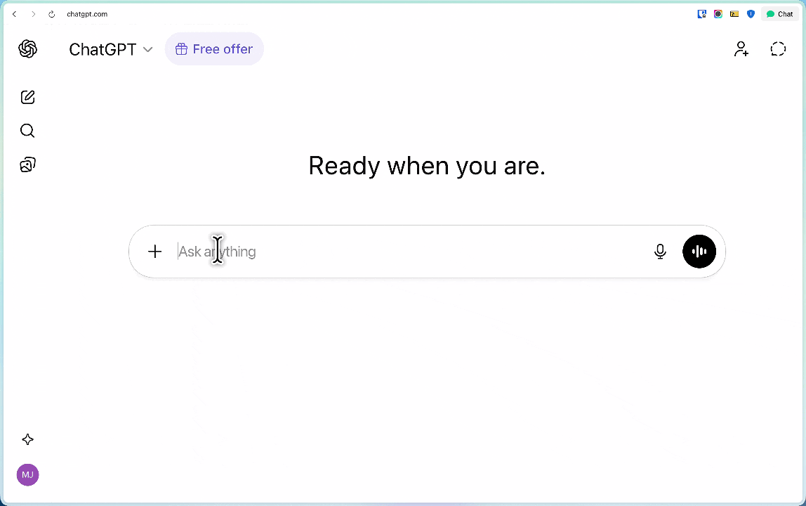

# 🎙️ VoiceType

**Stop typing. Just talk.**

VoiceType turns your voice into text and pastes it wherever your cursor is — instantly. No cloud, no subscription, no waiting.



---

## ⚡ How fast is it?

Hold a key → speak → release. Done. Your text is already there.

No switching apps. No copy-pasting. No repeating yourself. Just speak and keep moving.

---

## 📦 Install

### Direct download
[⬇️ Download VoiceType.dmg](https://github.com/mahdijafaridev/VoiceType/VoiceType.dmg)

Unzip and move `VoiceType.app` to your Applications folder.

### Homebrew
```bash
brew tap yourname/voicetype
brew install --cask voicetype
```

---

## 🚀 How to use it

1. Click into any text field — email, browser, notes, Slack, anywhere
2. Hold **Right Command (⌘)**
3. Speak
4. Release the key
5. Your words appear instantly ✅

> No focused input? No problem — the text goes straight to your clipboard. Just hit `Cmd+V`.

---

## 📋 Requirements

- macOS 13 (Ventura) or later
- That's it

---

## 🔧 First-time setup

On first launch VoiceType will ask for three things:

| Permission | Why |
|---|---|
| 🎤 Microphone | To hear you speak |
| 💬 Speech Recognition | To transcribe your voice |
| ♿ Accessibility | To paste text into other apps |

If you accidentally skipped any of them, go to `System Settings → Privacy & Security` and enable VoiceType under each section.

---

## 🛠️ Troubleshooting

**Nothing happens when I hold Right Command**
→ Go to `System Settings → Privacy & Security → Accessibility` and make sure VoiceType is toggled on.

**Text is not pasting**
→ Accessibility permission is missing. Click the VoiceType menu bar icon → "Request Accessibility Permission".

**Transcription is off**
→ Speak at a normal pace in a quiet space. Everything runs on-device on your Mac — no internet needed.

---

## 🔒 Privacy

Your voice never leaves your Mac. VoiceType uses Apple's built-in speech engine — fully on-device, works offline.

---

Built to save you time, every single day. 🕐